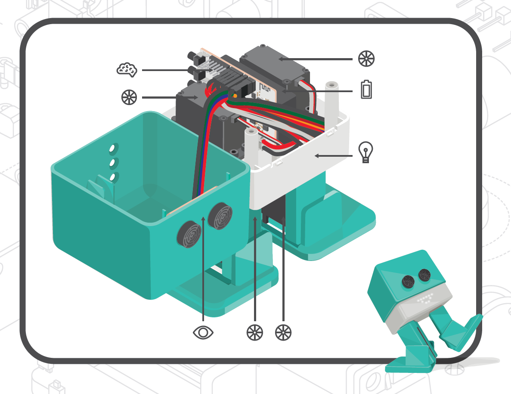
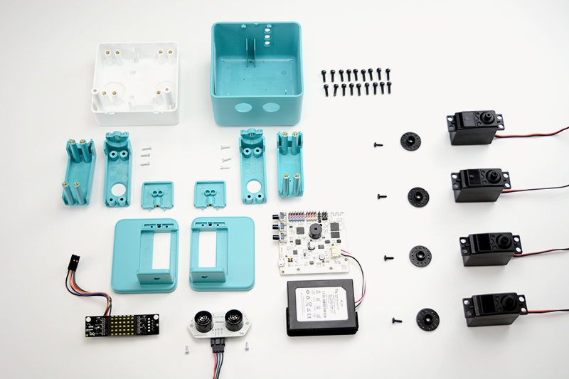

# Robótica Educativa

## SmartLiving Marbella 2016

### José Antonio Vacas @javacasm

# Ejemplo de juguete: Zowi

# Zowi es un robot

# ¿Qué hay dentro de Zowi?

* Placa controladora
* Batería
* Servomotores
* Sensor ultrasonidos
* Micrófono
* Zumbador
* Botones

* ¡¡ Y un programa !!

# [Zowi es open-source](https://github.com/bqlabs/zowi)

## Lo puedes [reprogramar](http://bitbloq.bq.com)

## Puedes cambiar su aspecto y Diseñar complementos

## Añadirle nuevos movimientos

[vídeo](https://twitter.com/BQAcademyES/status/695296147464806400)

## Algunos [ejemplos](https://github.com/bqlabs/zowi/tree/master/mods)

