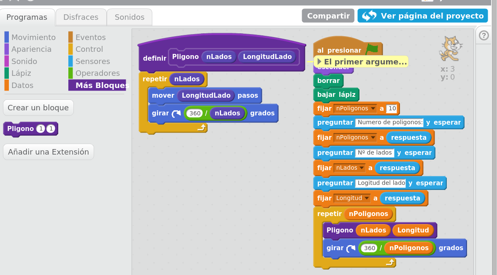

# Robótica Educativa

## SmartLiving Marbella 2016

### José Antonio Vacas @javacasm

# Herramientas

## [Arduino](https://github.com/javacasm/ProgramarParaEducar/blob/master/Arduino.md)

[Bitbloq](https://github.com/javacasm/ProgramarParaEducar/blob/master/BitBloq.md)

## Impresión 3D

## [Scratch](https://github.com/javacasm/ProgramarParaEducar/blob/master/Scratch.md)

## [AppInventor](https://github.com/javacasm/ProgramarParaEducar/blob/master/AppInventor.md)

## [Proyectos](https://github.com/javacasm/ProgramarParaEducar/blob/master/Proyectos.md)

[SkyBot](http://www.iearobotics.com/wiki/index.php?title=Mini-Skybot)

